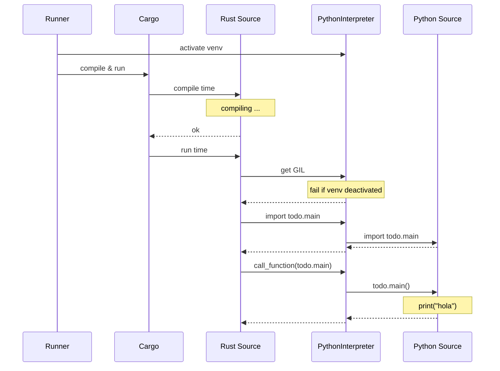

# Final flow

after several tries

```mermaid
sequenceDiagram
participant run as Runner
participant cargo as Cargo
participant rust as Rust Source
participant pyinterp as PythonInterpreter
participant python as Python Source

run ->> pyinterp: activate venv
run ->> cargo: compile & run

cargo ->> rust: compile time
note over rust: compiling ...
rust -->> cargo: ok

cargo ->> rust: run time
rust ->> pyinterp: get GIL
note over pyinterp: fail if venv deactivated
pyinterp -->> rust:

rust ->> pyinterp: import todo.main
pyinterp ->> python: import todo.main
python -->> pyinterp :
pyinterp -->> rust :

rust ->> pyinterp: call_function(todo.main)
pyinterp ->> python: todo.main()

note over python: print("hola")

python -->> pyinterp :
pyinterp -->> rust :
```
