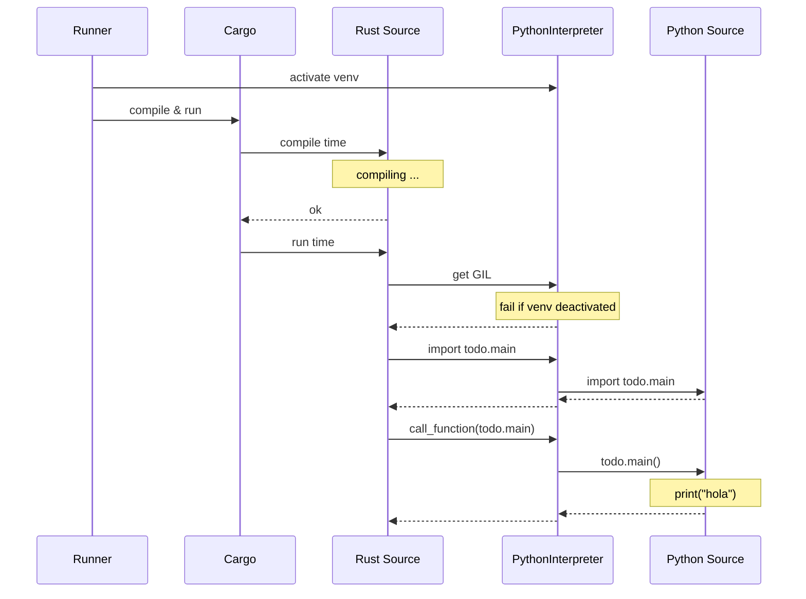

# Calling Python from Rust : Sending args and getting results back

Previous settings set the foundations for naively bouncing between both code bases. It's naive in the sense that it is only meant to set the piping through which the data should flow. Nonetheless, there is not "talking and answering" yet, let's try to do so.

Recap from previous step, we managed to call a python module from a rust code bases, let's copy the diagram from the first blog:

